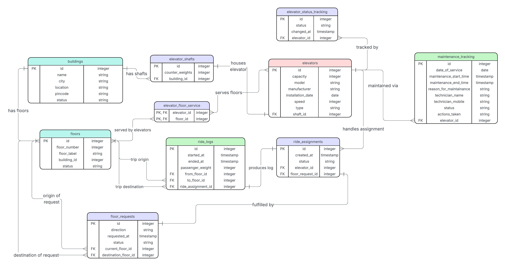

# Smart Elevator Control System ERD

## 📌 Project Overview
This project involves the database design and Entity-Relationship Diagram (ERD) for **LiftGrid Systems**. The system is designed to manage intelligent elevator platforms across large commercial buildings, handling real-time passenger movement requests, elevator allocation, and operational tracking. 

The database architecture supports multi-building deployments, dynamic ride assignments, historical trip logging, and hardware maintenance tracking.

## 🗺️ ER Diagram

## 🏗️ Key Architectural Decisions
This database design was built with scalability, physical hardware constraints, and strict data normalization in mind:

1. **Separation of Static Configuration and Dynamic Activity:** Hardware details (Buildings, Shafts, Elevators) are strictly isolated from real-time operational data (Requests, Assignments, Logs). This ensures that elevator configuration changes do not corrupt historical ride data.

2. **Physical Hardware Hierarchy:** The design models physical reality by establishing a `buildings` -> `elevator_shafts` -> `elevators` relationship. Since shafts are permanent concrete structures and elevators are replaceable machines, the foreign keys reflect hardware installation lifecycles.

3. **Normalized Ride Progression:** The lifecycle of a passenger trip is broken down into three distinct phases:
   * **The Request:** Where the passenger is and where they want to go.
   * **The Plan:** Which elevator is dispatched to answer the call.
   * **The Reality:** The actual historical trip data and weight loads completed by the elevator.

4. **Many-to-Many Floor Servicing:** A composite primary key table (`elevator_floor_service`) effectively handles the complex reality that an elevator can serve multiple floors, and a single floor can be served by multiple elevators.

## 🗄️ Entity Design Rationale

### Infrastructure Topology
* **`buildings`, `floors`, and `elevator_shafts`:** These form the rigid, static topology of the site. They are deliberately separated so that if an elevator car is scrapped and replaced, the spatial mapping of the building remains completely untouched.
* **`elevators` & `elevator_floor_service`:** The `elevators` table contains the replaceable hardware constraints. The junction table exists because express or service elevators often bypass specific floors. This table provides the routing logic for the dispatch algorithm, ensuring passengers aren't assigned to an elevator that physically cannot stop at their destination.

### Operational Pipeline
* **`floor_requests` -> `ride_assignments` -> `ride_logs`:** These tables represent a strict chronological pipeline. A user's button press generates a request. The system's routing algorithm claims that request by writing to `ride_assignments`. Finally, hardware sensors generate the `ride_logs` once the trip concludes. Separating these ensures that unfulfilled, queued, or canceled requests do not pollute the actual historical performance metrics.

### Lifecycle & Auditing
* **`maintenance_tracking` & `elevator_status_tracking`:** These are historical audit tables. By keeping maintenance windows and state changes out of the main `elevators` table, the system preserves a complete history of hardware downtime and servicing for predictive maintenance analysis without bloating the core configuration tables.